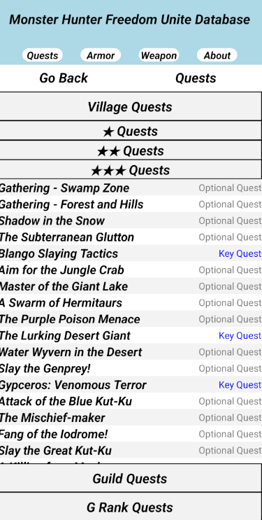
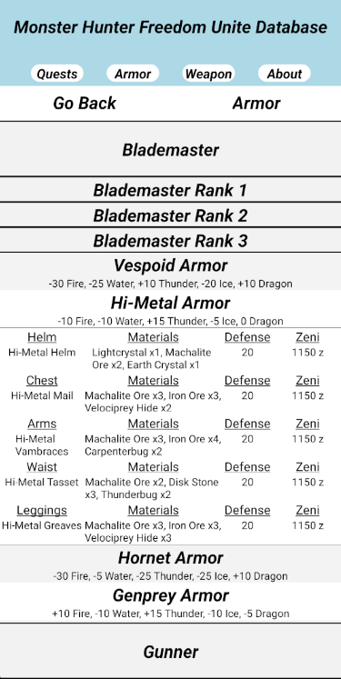
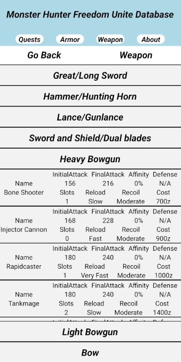

# Monster-Hunter-Freedom-Unite-DB

Database application to better help me understand react native. Application contains information about Quests, Armor and Weaopons that were used in https://monsterhunter.fandom.com/wiki/Monster_Hunter_Freedom_Unite.

# Quest 

Quest are contained into three sections Village, Guild and G rank which are then placed into their star ranks. Quests provide the type of importance they are to the game as in being a optional, key or urgent quest along with its objective goal, quest description, monster shown and few more.

# Armor

Armor sets are organized by their ranks and placed into their type based on being part of the Blademaster class or Gunner Class. Information is shown by displaying the armor sets name along with their status resistance. When pressing on a armor set more information will appear giving more detail about the helm, chest, braces, waist and leggings.

# Weapon

Weapons are organized into GreatSword/LongSword,  Hammer/HuntingHorn, Lance/Gunlance, HeavyBowgun, LightBowgun and Bow. Weapons contain information about weapon Attack, Affinity, Elemental Status and a few other

